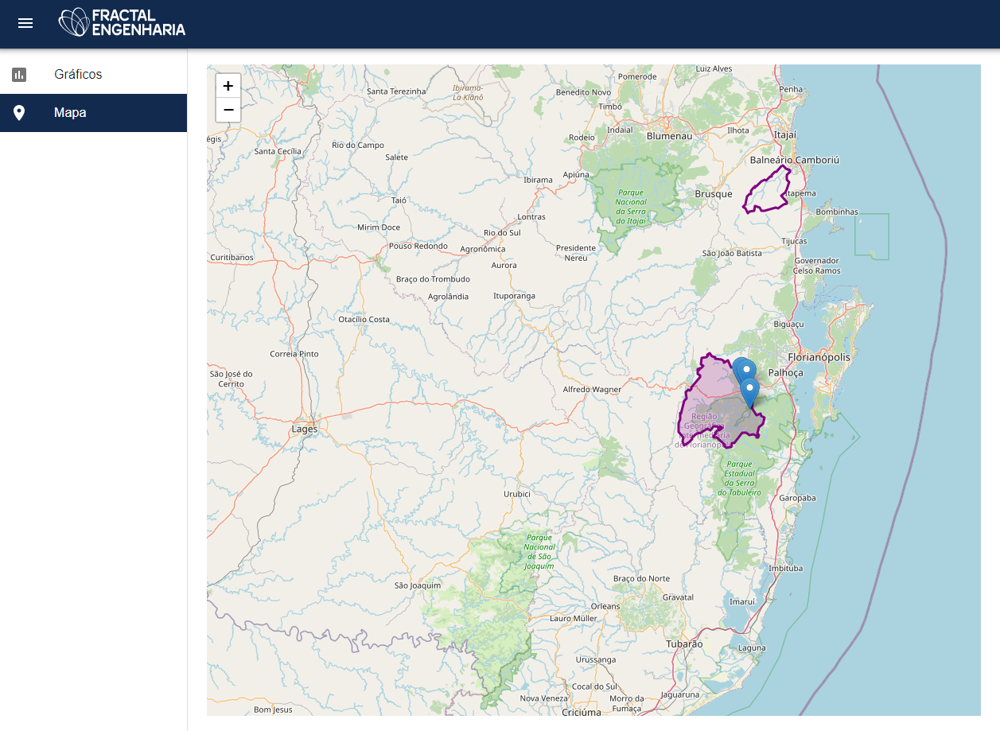

<h1 align="center">
    
</h1>

<p align="center">
  <a href="#-technologies">Technologies</a>&nbsp;&nbsp;&nbsp;|&nbsp;&nbsp;&nbsp;
  <a href="#-preview">Preview</a>&nbsp;&nbsp;&nbsp;|&nbsp;&nbsp;&nbsp;
  <a href="#-layout">Getting started</a>&nbsp;&nbsp;&nbsp;|&nbsp;&nbsp;&nbsp;
  <a href="#-project">Project</a>&nbsp;&nbsp;&nbsp;|&nbsp;&nbsp;&nbsp;
</p>

## 🧪 Technologies

This project was developed using the following technologies:

- [React](https://reactjs.org)
- [TypeScript](https://www.typescriptlang.org/)
- [Leaflet](https://leafletjs.com/)
- [Highcharts](https://www.highcharts.com/)
- [Material UI](https://material-ui.com/pt/)

## 🔥 Preview

[](https://fractal.rcarrenho.com.br/)

## 🚀 Getting started

Clone the project and access the folder

```bash
$ git clone https://github.com/rafacarrenho/Fractal-React && cd Fractal-React
```

Follow the steps below

```bash
# Install the dependencies
$ npm install

# Start the project
$ npm start

```

Or with Yarn

```bash
# Install the dependencies
$ yarn install

# Start the project
$ yarn start

```

## 💻 Project

[Fractal](https://fractal.rcarrenho.com.br/) was developed to validate knowledge in React, Leaflet and Highcharts libs.

In this project I used proxy api for cors too.

---

<p align="center">Made with 💜 by Rafael Carrenho</p>
